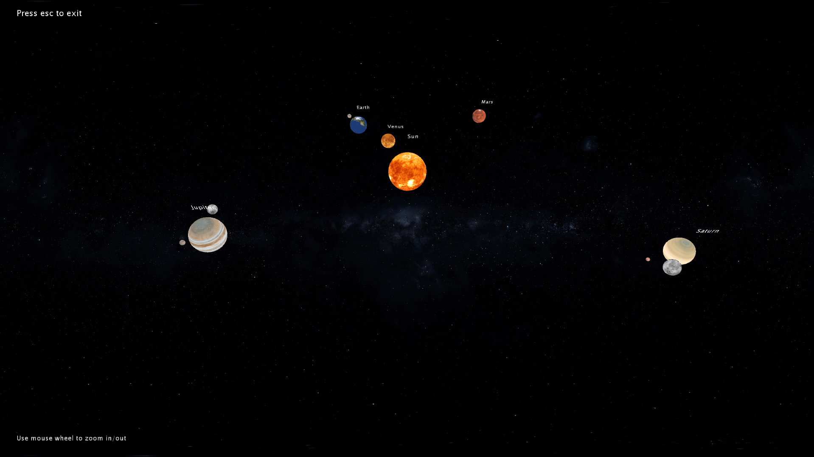

# SistemaSolar
# Datos
Autor: Fernando Marcelo Alonso

Asignatura: Creando Interfaces de Usuario(CIU)

## Introducción
Esta práctica consiste en realizar un simulación simple de un sistema solar.

## Implementación y argumentación

Para la implementación del juego he usado Processing 3.5.4.

**Simulación:** El programa solo tiene una pantalla donde se observa la simulación del sistema solar en cuestión, en este caso sería nuestro sistema solar con los planetas Venus, la Tierra, Marte, Júpiter  y Saturno, opte por poner 5 para que no se sobrecargara la pantalla de información, también hay 5 satélites  2 en Júpiter , 2 en Saturno y la luna. Obviamente la simulación no pretende ser realista.

**Planetas:** Para simular el comportamiento de los planetas se usan, el ángulo en el eje x con el sol (ángulo de revolución), el ángulo de rotación del planeta, su distancia al objeto al que gira y el radio del planeta. Para ello cree una clase que se encarga de tener esta información, la clase se llama Planet.

**satélites :** Se construyen igual que los planetas con la clase planeta pero estos no giran al rededor del sol sino de otro planeta.

**Adaptación resolución:** Como este programa se puede ejecutar en computadores con resoluciones muy distintas he optado por que el tamaño sea relativo a la pantalla del usuario con lo que primero he puesto pantalla completa, esto nos permite obtener el ancho y alto de la pantalla del usuario, cree una variable que depende de estos valores con lo que se verá exactamente igual en distintos dispositivos (Ver sección de código para más detalles).

**Movimiento:** Hay dos movimientos básicos de los planetas, el de revolución al rededor del sol y el de rotación sobre si mismo, la velocidad de rotación y revolución de cada planeta es ajustable.

**Zoom** Se permite al usuario acercar y alejar el sistema solar con la rueda del mouse.

**Nombre planetas:** Mientras giran los planetas encima de ellos se muestra el nombre de los mismos, para poder localizar de forma sencilla cual es cada planeta.

## Código

#### Variables:

+ **Planet sun, mercury, venus, earth, mars, jupiter, saturn, uranus, jupiterSat1, jupiterSat2, saturnSat1, saturnSat2, moon:** Declaración de todos los planetas y satélites.
+ **Planet[] jupiterSats, earthSats, saturnSats:** Arrays de satélites de los planetas con satélites.
+ **PImage background:** Variable que guardara la imagen del background.
+ **float scale:** Escala del sistema, con la rueda del ratón se modifica dicha variable pudiendo acercar y alejar el sistema.
+ **float minSize:** En vez de usar los pixeles como tamaño de referencia usaremos minSize que dependerá del ancho de la pantalla, en mi caso lo puse a width/140, todas las distancias o tamaños se pondrán con respecto a minSize por ejemplo el radio del sol minSize * 5, con lo que se verá igual en todas las resoluciones.

#### Métodos clase Planet:

+ **move:** Mueve los planetas un poco en función de la velocidad de rotación y de revolución que le hayamos dado.
+ **display:** Hay dos métodos display uno sin parámetros que muestra simplemente el planeta, el otro se le pasa un array de planetas y muestra estos planetas girando alrededor del planeta original con lo que estos "planetas" son satélites del planeta desde el que se llama a este método.

## GIF

